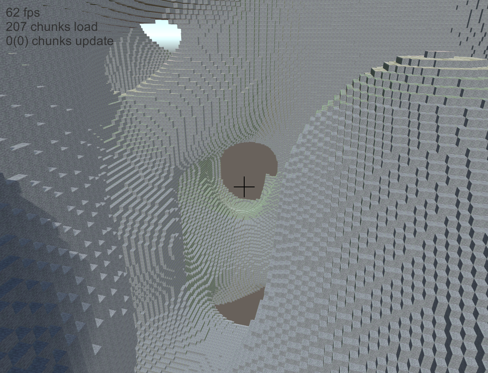

# MicroCraft

使用Unity完成MineCraft的创造模式

### 对于基本地形生成的尝试

1. 直接使用三维柏林噪声作密度
   
        float density = densityNoise;

    

2. 使用三维噪声+均匀重力场
   
        float heightOffset = -2f * y / heightMax + 1f;
        float density = densityNoise + heightOffset;
    
    

3. 划分海洋陆地
   
        float heightOffset = 5f * ((float)-y / heightMax + .5f);
        float oceanOffset = Clamp(oceanNoise2 * -8, -0.4f, 0.4f);
        float density = densityNoise3 + heightOffset + oceanOffset;

    

